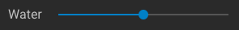
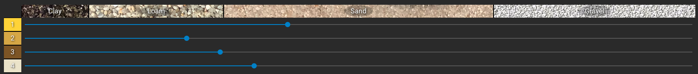
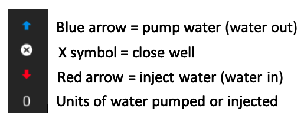

title: Sand Tank User Manual
---

**Welcome! Thanks for your interest in exploring the ParFlow Sandtank. We designed this interactive computer simulation to facilitate learning about real hydrology concepts. This model will allow you to dive into the world of groundwater hydrology, making decisions about inputs to groundwater aquifer systems, visualizing model outputs, and learning about various factors that impact real environmental systems. We hope you have fun and learn a lot using this interactive educational tool!**

*__Getting Started:__ This manual is designed to familiarize you with the parts of the ParFlow Sandtank model and the options available to you as a user. We hope this builds your curiosity and draws you over to our other available lessons to use with this sandtank model.*

*Figure 1: View of the ParFlow Sandtank, with labeled elements described in this manual.*

## Top Toolbar Buttons

*Water Drop Button* --- Clicking on this button will allow you to change the background color from black (default) to white.

*Lake/River Dropdown Menu* --- Click on this button to show a dropdown menu where you can select either "River" or "Lake." The River option will set up the associated feature (label 14 in figure 1) to behave like a river, allowing water to flow freely through the feature (drain). If you select the Lake option, the feature will hold water according to the hydraulic head levels and the amount of water added/removed from the system through injecting or pumping.

*Clock Icon* --- This icon identifies the number of time steps that have been carried out in the system. To the right of the clock icon, will be a value that represents the number of time steps (e.g., 28 timesteps have run in the example image above). When you choose to click the "Reset" button (followed by "Run") this count will go to zero.

*Run Button* --- Click on this button to see how any changes you have made impact the system. Each time you click on the "Run" button, ten timesteps will be carried out.

*Reset Button* --- Click on this button to reset the sandtank to default starting conditions. Important: After you click on the "Reset" button you must select the "Run" button to carry out the reset.

*Question Mark Button* --- If you mouse over this button it will display a value for the total amount of water stored (in cubic meters) in the lake feature of the tank (if you have the "Lake" option selected from the dropdown menu described above). If you have the "River" option selected the value will be river flow in cubic meters per second.

## Remaining Buttons

*Tank Conditions Button* --- When you click on this button, it will open a variety of options onscreen below the sandtank (you may need to scroll down to see these options).

*Opacity Sliders* --- You will see five slider tools along the top of this lower option screen. From left to right your options are Soil, Water, Wells, Still Water, and Pollutant. If you would like the material to be more opaque (i.e. not able to be seen through), adjust the slider to the right. If you would like the material to be less opaque (i.e. more able to be seen through), adjust the slider to the left.

*Soil Slider* --- This slider allows you to adjust the opacity of the soil materials. This tool is useful if you would like to see the other sand tank conditions better (e.g., pollutant, water saturation, etc.).

*Water Slider* --- This slider allows you to adjust the opacity of the water in the tank. This tool is useful if you would like to see other sand tank conditions better (e.g., soil properties, pollutant, etc.). Note: When running the sandtank, you will need to set the water opacity to about midpoint in order to see the soil materials in the system (if opacity is set all the way to the right at maximum you will only see water where you have set the hydraulic head level).

*Wells Slider* --- This slider allows you to adjust the opacity of the wells in the sand tank. Note: When you adjust the opacity of the wells, any water present in the wells will adjust in the same way. This tool is useful if you'd like to examine how a natural system, with no human impact from extraction or injection, would behave under various conditions.

*Still Water Slider* --- This slider allows you to adjust the opacity of the water in the River/Lake feature (label 14 in figure 1) and the Leaky Landfill feature (label 13 in figure 1). This tool is useful if you'd like to observe how the still water levels compare to water table levels of the system or in a particular well.

*Pollutant Slider* --- This slider allows you to adjust the opacity of the pollutant when injected into the sandtank system using a well. This tool is useful if you'd like to compare what the system looks like before and after injecting pollutant, rather than resetting the system; or if you'd like to remove the pollutant without resetting the other conditions in the system.

*Soil Material Selection Sliders* --- This section allows you to choose what soil material type to apply in each section of the sandtank. The color-coded tank layout corresponds to a number on the slider toolbar (yellow=1; tan=2; brown=3; white=4). This allows you to visualize where the materials you select will be located in the tank. Users may choose between Clay, Loam, Sand, and Gravel (Want to know more about these materials? Check out some of our available lessons and videos!). As you move the sliders along the selection range, there is a number in a blue bubble present. This number represents the hydraulic conductivity of the material, or how readily water moves through that particular material (Higher K = easier for water to move through; lower K = harder for water to move through).

*Life Preserver Button* --- This is the button you press if you need help with the sand tank. It will direct you to this user manual, along with other helpful videos to get you started using the ParFlow Sandtank.

## Sandtank Selection Buttons

Now that you're an expert on all the available buttons, let's move to the actual tank and get running! There are 11 wells in the ParFlow sandtank. Each well has a pumping/injection/off switch above it, described below.

*Pump/Inject/Close Well Switch* --- For on-screen well identification, mouse over each well and it will display an identification (i.e., well A, well B, etc.). Use the switch to either pump (pull water out), inject (put water in), or turn a well off using the blue arrow, red arrow, or X symbol. The value below the switches shows the units of water being pumped or injected. Negative numbers indicate pumping has occurred (water removed from system); Positive numbers indicate injection has occurred (water has been added to the system). When a well has reached its maximum value for pumping or injecting, the associated arrow will be grayed out and you will not be able to select it until the system has re-equilibrated. Note: When you inject water into the system, you will also notice that pollution comes with this water (red color). This feature can be used to demonstrate how pollution moves through a groundwater system. If you do not want to see pollution for your particular use, just use the pollutant slider and decrease the opacity all the way to the left.

*Hydraulic Head Sliders* --- At the left and right sides of the sandtank model, you will see two blue bars. These represent the hydraulic head of the system (i.e., the height of the water) and impact the level of the water table (To learn more about hydraulic head and the water table, see our available lessons!). You can drag the blue line up or down to increase or decrease the amount of water available to the system, respectively. After moving the line, click on the "Run" button and watch as the water table line changes. You can see the number at the bottom of the slider column changes as you move the slider. This number represents the measurement for the hydraulic head, in centimeters.
Note: Depending on how much you adjust the head sliders, you may have to click the "Run" button more than once to allow the water table to equilibrate.

## Basic Sandtank Run

Now let's walk through a simple exercise using the ParFlow Sandtank to test your skills:

1.  Open the ParFlow Sandtank:
2.  Click on the *River/Lake* dropdown menu and choose **"Lake"**.
3.  Click the **"Run"** button in the upper right corner.
4.  Click on *Tank Conditions* button.
5.  Scroll down to the *Soil Material Selections*.
6.  For soil material number 1, move the slider to **"Loam"**; For number 2, move the slider to **"Sand"**; For number 3, move the slider to **"Gravel"**; For number 4, move the slider to **"Clay".**
7.  Set each Hydraulic Head slider to about 40.00.
8.  Click on the **"Run"** button.
9.  Observe the timesteps passing and the water table rising.
10. Notice that your lake is filled with water; mouse over the *Question Mark* button and see how much water is being stored in this feature (should be around 81m3).
11. Move the *Water Opacity* slider to the middle so you can see the soil materials better through the water.
12. Hover over Well D, the 4th well from the left. Inject 45 units of water by clicking on the red arrow until the number above the well is 45. Click the **"Run"** button.
13. Observe the water table rising and the introduction of pollution to the system.
14. Click on the *River/Lake* dropdown menu and choose **"River."** Click the **"Run"** button.
15. Observe as the Lake drains---what is the river flow? (Remember to hover over the *Question Mark* button)
16. Drop the right *Hydraulic Head* slider to about 10.00. Click the **"Run"** button.
17. Watch as the water table drops down---you may have to select **"Run"** multiple times.
18. Good Job! The skills are strong with you! Now go look at some associated lessons and become more of an expert!

    
    

