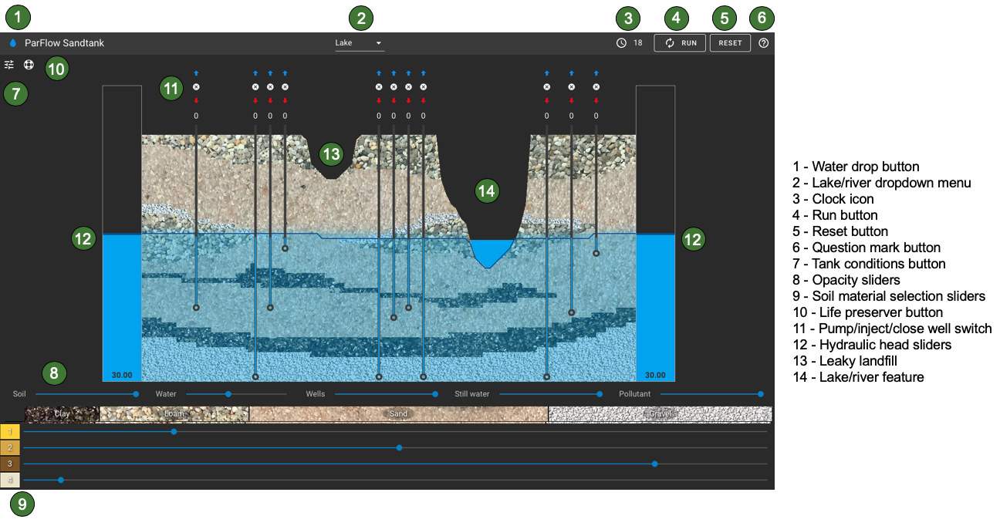

# Summary

The `ParFlow Sand Tank` model is an open source application designed to allow users to interactively simulate and visualize groundwater movement through the subsurface. The app is designed for both research and education; teaching hydrogeology concepts and making it easy explore and run sophisticated groundwater simulations. Our goal is to support increased accessibility and usability of research grade hydrology tools for research and teaching.

The `Sand Tank` application simulates groundwater and surface water fluxes as well as contaminant transport in real time using the integrated physical hydrology model [ParFlow](https://parflow.org/) [@Maxwell:2005; @Kollet:2006; @OseiK:2014] and the particle tracking code [EcoSlim](https://github.com/reedmaxwell/EcoSLIM) [@Maxwell:2019]. ParFlow is a numerical hydrology model that simulates spatially distributed groundwater and surface water flow. It is a well established research tool with more than 90 publications documenting its development use to advance our understanding of groundwater dynamics and groundwater surface water interactions from the hillslope to the continental scale e.g. [@Maxwell:2016; @Condon:2019; @Condon:2020]. It is designed for efficient parallel computation and has been run on many platforms spanning from laptops to supercomputers. However, one of the challenges of ParFlow is that it requires significant training and hydrologic expertise to develop simulations.   

The Sand Tank application makes this model accessible to anyone for education and exploration.  Our application uses ParFlow for its simulation backend and [ParaView](https://www.paraview.org/) for the data loading and processing. The communication infrastructure relies on the [ParaViewWeb](https://www.paraview.org/web/) framework. We use model templates deployed in Docker images to setup the Sand Tank framework. Users can build the application locally or interact with it through our web deployment. When interacting with a template users can interactively change model parameters like subsurface processes or pump/inject water into the subsurface and watch the system respond to their changes in real time as the simulation runs.  Additionally, our template setup will allow more advanced users to build custom templates of increasing complexity for both research and educational purposes.

# Uses and Functionality
The `Sand Tank` is designed for real time exploration of groundwater flow. We have a web application which facilitates easy use by students and teachers, but the framework is also very flexible and can accommodate much more complex templates that can be customized by users for research.

The default `Sand Tank` template shown in Figure 1, simulates a cross section of the subsurface that includes multiple subsurface units with different physical properties that can be adjusted by the users. It also includes a series of groundwater wells that can be used to pump or inject water into the subsurface. Injected water is traced through the system using particle tracking so the user can visualize flow paths.

In addition to the web application, the `Sand Tank` may be deployed locally. Instructions for building and running locally are included in the repo. The default template is the Sand Tank model shown in Figure 1; however this template can be easily adjusted for additional research or educational purposes.  Additional templates can be used by simply appending the template name to the sand tank call.

# Resources and Documentation:
Full documentation of the application can be found [Here](https://hydroframe.github.io/SandTank/).  

- Users can access a live version of web application directly without any setup [here](https://www.hydroframe.org/groundwater-education-tools)

- For users of the web application we have a [User Manual](https://www.hydroframe.org/sand-tank-user-manual) which details the main parts of the web application and the options available to the user. As well as [lesson Plans and instructional videos](https://www.hydroframe.org/lesson-plans) for classroom activities.

- For more advanced users and developers we have instructions for building and running the application [locally](https://hydroframe.github.io/SandTank/docs/run_application.html) as well as instructions for building new [templates](https://hydroframe.github.io/SandTank/docs/template.html).

# Acknowledgements

This material is based upon work supported by the Department of Energy under Award Number(s) DE-SC0019609 - Cloud/Web-based Advanced Modeling and Simulation Turnkey High-Performance Computing Environment for Surface and Subsurface Science and the US National Science Foundation Office of Advanced Cyberinfrastructure under Award number OAC-1835855.

# References
